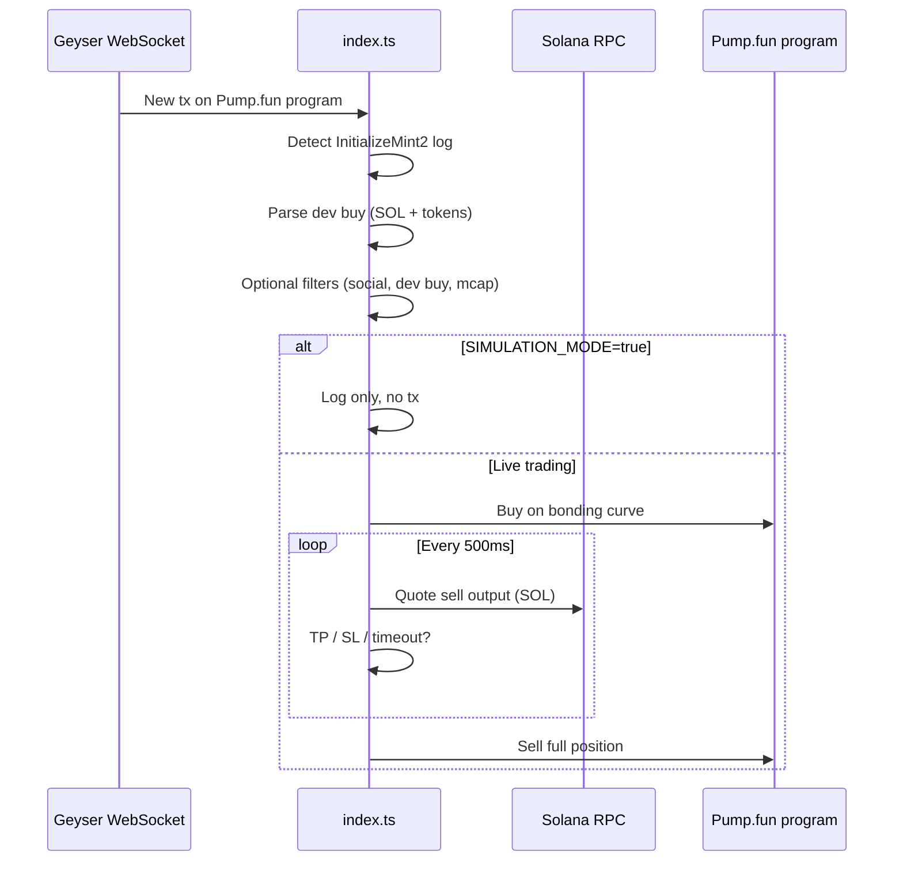

# Pump.fun Sniper

A low-latency Solana Pumpfun Sniper bot that watches **Pump.fun** token launches in real time over a **Geyser** WebSocket feed, applies configurable filters, buys on the bonding curve, and exits automatically via take-profit, stop-loss, or timeout.

Built with TypeScript, Anchor, and the official Pump.fun program IDL. Supports **Token-2022** mints (including transfer-fee harvest on cleanup).

---

## Table of contents

- [How it works](#how-it-works)
- [Features](#features)
- [Requirements](#requirements)
- [Quick start](#quick-start)
- [Configuration](#configuration)
- [Exit logic](#exit-logic)
- [Transaction submission](#transaction-submission)
- [Scripts](#scripts)
- [Project structure](#project-structure)
- [Security](#security)
- [Troubleshooting](#troubleshooting)
- [Disclaimer](#disclaimer)

---

## How it works



1. **Subscribe** — Opens a Geyser `transactionSubscribe` stream filtered to the Pump.fun program (`6EF8rrecthR5Dkzon8Nwu78hRvfCKubJ14M5uBEwF6P`).
2. **Detect** — When logs contain `Instruction: InitializeMint2`, the bot treats the transaction as a new launch and extracts mint, bonding curve, and dev wallet from account keys.
3. **Parse** — Reads the creator’s initial buy from inner instructions (`parseDevBuyFromInnerInstructions`) and resolves the token program (legacy SPL vs Token-2022).
4. **Filter** — Optional checks: social links (X / Telegram / website), dev buy size band, minimum market cap wait.
5. **Trade** — If `SIMULATION_MODE=false`, submits a buy then monitors unrealized SOL value until take-profit, stop-loss, or timeout triggers a sell.

Detection latency is logged in milliseconds (`Date.now() - firstTime` at buy time).

---

## Features

| Area | Capability |
|------|------------|
| **Speed** | Geyser `processed` commitment — reacts before typical polling RPC |
| **Quote pools** | SOL and **USDC** bonding-curve pairs (`SNIPE_QUOTE_MODE`) via Pump `buy_v2` / `sell_v2` |
| **Safety** | `SIMULATION_MODE` — full pipeline without sending transactions |
| **Filters** | Dev buy min/max, market cap gate, X / Telegram / website validation |
| **Risk** | Take-profit %, stop-loss %, position timeout (seconds) |
| **Execution** | NextBlock, bloXroute, or standard RPC + compute budget priority fee |
| **Tokens** | Token-2022 + legacy SPL; bonding curve PDA / creator vault from on-chain layout |
| **Cleanup** | `npm run burn` — burn leftover balances and close ATAs (reclaim rent) |

---

## Requirements

- **Node.js** 18+ (22 recommended per `devDependencies`)
- A funded Solana wallet (base58-encoded secret key)
- **Helius** (or compatible) endpoints:
  - HTTP RPC + WebSocket RPC for reads, confirms, and quotes
  - **Atlas Geyser** WebSocket for `transactionSubscribe` (see [Helius Geyser docs](https://docs.helius.dev/))
- Optional paid infra for competitive inclusion:
  - [NextBlock](https://nextblock.io/) API key (`NEXT_BLOCK_API`)
  - [bloXroute](https://bloxroute.com/) auth header

You need enough **SOL** for transaction fees, priority tips, and rent. For USDC pool snipes, your wallet also needs sufficient **USDC** (SPL) balance plus a USDC ATA (created automatically on first buy).

---

## Quick start

```bash
git clone <your-repo-url>
cd pumpfun-sniper
npm install
cp .env.example .env
```

Edit `.env`:

1. Set `PRIVATE_KEY` (base58 secret key — **never commit this**).
2. Set `RPC_ENDPOINT`, `RPC_WEBSOCKET_ENDPOINT`, and `GEYSER_RPC` with your provider API keys.
3. Keep `SIMULATION_MODE=true` until filters and sizing look correct in logs.
4. Set `NEXTBLOCK_MODE=true` and `NEXT_BLOCK_API` if you use NextBlock (default in `.env.example`).

Run in simulation (recommended first):

```bash
npm run dev
```

When ready for live trades:

```bash
# In .env
SIMULATION_MODE=false

npm start
```

---

## Configuration

Copy `.env.example` to `.env`. All variables below are read at startup; missing required values exit the process.

### Wallet & RPC

| Variable | Required | Description |
|----------|----------|-------------|
| `PRIVATE_KEY` | Yes | Base58-encoded wallet secret key |
| `RPC_ENDPOINT` | Yes | HTTP RPC URL (e.g. Helius mainnet) |
| `RPC_WEBSOCKET_ENDPOINT` | Yes | WebSocket RPC URL |
| `GEYSER_RPC` | Yes | Geyser WebSocket URL (e.g. `wss://atlas-mainnet.helius-rpc.com/?api-key=...`) |

### Quote pool mode

| Variable | Default (example) | Description |
|----------|-------------------|-------------|
| `SNIPE_QUOTE_MODE` | `both` | `sol` = SOL pairs only, `usdc` = USDC pairs only, `both` = snipe either |
| `USDC_MINT` | `EPjFW...` | Mainnet USDC mint (change only for custom deployments) |
| `BUY_AMOUNT_USDC` | `10` | USDC spent per USDC-pool snipe |
| `MARKET_CAP_USDC` | `4000` | Market cap threshold in USDC when `CHECK_MARKET_CAP=true` |
| `MIN_DEV_BUY_AMOUNT_USDC` | `0` | Min creator buy in USDC when `CHECK_DEV_BUY=true` |
| `MAX_DEV_BUY_AMOUNT_USDC` | `500` | Max creator buy in USDC; empty = no cap |

USDC pairs use Pump.fun **`buy_v2` / `sell_v2`** (via `@pump-fun/pump-sdk`). SOL pairs continue to use the legacy `buy` / `sell` path for maximum compatibility.

### Trading

| Variable | Default (example) | Description |
|----------|-------------------|-------------|
| `SIMULATION_MODE` | `true` | `true` = detect and log only; `false` = send buy/sell |
| `BUY_AMOUNT` | `0.005` | SOL spent per SOL-pool snipe |
| `SLIPPAGE` | `100` | Slippage in **percent** (100 = 100%) applied to max SOL on buy |
| `TAKE_PROFIT` | `20` | Exit when sell quote ≥ `BUY_AMOUNT × (100 + TAKE_PROFIT) / 100` SOL |
| `STOP_LOSS` | `10` | Exit when sell quote ≤ `BUY_AMOUNT × (100 - STOP_LOSS) / 100` SOL |
| `TIME_OUT` | `60` | Max seconds to wait (market cap monitor or sell monitor) |
| `CHECK_MARKET_CAP` | `false` | Wait until bonding-curve market cap ≥ `MARKET_CAP` before buying |
| `MARKET_CAP` | `30` | Target market cap in **SOL** for SOL pools when `CHECK_MARKET_CAP=true` |

### Dev buy filter

| Variable | Description |
|----------|-------------|
| `CHECK_DEV_BUY` | `true` to enforce min/max on creator’s initial buy |
| `MIN_DEV_BUY_AMOUNT` | Minimum dev buy in SOL; empty / unset = `0` |
| `MAX_DEV_BUY_AMOUNT` | Maximum dev buy in SOL; empty / `none` / `unset` = no cap |

### Social filters

When enabled, metadata is fetched via Metaplex (with retries). The token is skipped if links fail validation.

| Variable | Validation |
|----------|------------|
| `CHECK_X` | `twitter` must contain `https://x.com` |
| `CHECK_TG` | `telegram` must contain `https://t.me` |
| `CHECK_WEBSITE` | `website` must be non-empty |

### Transaction fees & routing

| Variable | Description |
|----------|-------------|
| `NEXTBLOCK_MODE` | `true` — submit via NextBlock (`fra.nextblock.io`) + tip transfer |
| `NEXT_BLOCK_API` | NextBlock authorization header / API key |
| `NEXT_BLOCK_FEE` | SOL tip to NextBlock address on each tx |
| `BLOXROUTE_MODE` | `true` — submit via bloXroute trader API |
| `BLOXROUTE_FEE` | bloXroute tip amount |
| `BLOXROUTE_AUTH_HEADER` | bloXroute `Authorization` value |
| `PRIORITY_FEE` | SOL used to derive compute-unit price on buy/sell (see `ComputeBudgetProgram.setComputeUnitPrice`) |

**Routing priority:** If `NEXTBLOCK_MODE=true`, NextBlock is used. Else if `BLOXROUTE_MODE=true`, bloXroute is used. Otherwise the bot uses `connection.sendRawTransaction` with the configured priority fee.

> **Note:** `JITO_MODE` / `JITO_FEE` appear in `.env.example` but are **not** wired in `src/constants/constants.ts` (commented out). Jito helper code exists under `src/executor/jito.ts` but is not used by the main sniper loop.

### Not yet implemented

These keys exist in `.env.example` but are **not** read by the application today:

- `DEV_MODE`, `DEV_WALLET_ADDRESS`
- `TICKER_MODE`, `TOKEN_TICKER`
- `POSITION_CONTROL`, `POSITION_NUMBER` (position limit in `index.ts` is partially present but env wiring is commented out)

Do not rely on them until added to `src/constants/constants.ts` and `src/index.ts`.

---

## Exit logic

After a successful buy, `monitorSellPosition` polls every **500 ms**:

1. Loads your token balance (retries with backoff).
2. Quotes SOL out via bonding curve (`getSellPrice`).
3. Compares quote to thresholds (computed at startup from `BUY_AMOUNT`):

```
Take-profit threshold (TP) = BUY_AMOUNT × (100 + TAKE_PROFIT) / 100
Stop-loss threshold (LS)  = BUY_AMOUNT × (100 - STOP_LOSS) / 100
```

4. Sells when:
   - `outAmount >= TP` → take profit
   - `outAmount <= LS` → stop loss
   - Elapsed time ≥ `TIME_OUT` → timeout exit
   - Balance is zero → stop monitoring

Example: `BUY_AMOUNT=0.005`, `TAKE_PROFIT=20`, `STOP_LOSS=10` → TP at **0.006 SOL** quoted out, SL at **0.0045 SOL** quoted out.

---

## Transaction submission

```text
Buy / Sell transaction
├── Compute budget (250k units + priority fee from PRIORITY_FEE)
├── Create ATA idempotently if needed
├── Anchor Pump.fun buy/sell instruction
└── Submit via:
    ├── NextBlock API (NEXTBLOCK_MODE) + tip
    ├── bloXroute (BLOXROUTE_MODE) + tip
    └── RPC sendRawTransaction + confirm
```

Buy and sell share the same routing flags. Ensure only one “fast path” mode matches your infrastructure setup.

---

## Scripts

| Command | Description |
|---------|-------------|
| `npm run dev` | Run sniper with `ts-node` |
| `npm start` | Same as `dev` |
| `npm run build` | Compile TypeScript to `dist/` |
| `npm run burn` | Burn all token balances and close empty ATAs (rent reclaim) |
| `npm run encrypt` | Obfuscate compiled `dist/` → `dist-encrypt/` (optional release build) |

### Burn utility

`src/burn.ts` scans SPL and Token-2022 accounts, burns non-zero balances, harvests withheld fees on Token-2022 mints, and closes accounts. Useful after many snipes to recover rent.

```bash
npm run burn
```

Requires only `PRIVATE_KEY` and `RPC_ENDPOINT` in `.env`.

---

## Project structure

```text
src/
├── index.ts                 # Geyser listener, filters, buy/sell orchestration
├── burn.ts                  # Token burn + ATA cleanup
├── constants/
│   └── constants.ts         # Env → exported config
├── executor/
│   ├── bloXroute.ts         # bloXroute submission
│   ├── jito.ts              # Jito bundle helper (not active in main flow)
│   └── legacy.ts
├── pumputils/
│   ├── idl/                 # Pump.fun Anchor IDL
│   ├── utils/               # buyToken, sellToken, pricing, bonding curve
│   └── bloxutils/           # bloXroute quote helpers
└── utils/
    ├── parseDevBuy.ts       # Dev buy extraction from Geyser payload
    └── utils.ts             # Env helpers, JSON debug helpers
```

Pump.fun program ID (subscribe filter): `6EF8rrecthR5Dkzon8Nwu78hRvfCKubJ14M5uBEwF6P`

---

## Security

- **Never** commit `.env` or share `PRIVATE_KEY`.
- Use a **dedicated hot wallet** with only the SOL you are willing to lose.
- Start with **`SIMULATION_MODE=true`** and small `BUY_AMOUNT`.
- Verify RPC and Geyser URLs point to mainnet (or devnet) intentionally.
- Review third-party tip endpoints (NextBlock / bloXroute) on their official docs.
- This software does not encrypt keys at rest; OS-level disk encryption and access control are your responsibility.

---

## Troubleshooting

| Symptom | Things to check |
|---------|------------------|
| Process exits immediately | Required env var missing — console prints `X is not set` |
| No detections | Geyser URL valid? API key has Geyser access? Firewall allows WSS |
| `WebSocket is open` but nothing else | Pump.fun activity; filter logs for `InitializeMint2` |
| Buys always skipped | `CHECK_*` filters too strict; dev buy outside min/max; mcap timeout |
| `Transaction failed` | Low slippage vs volatile curve; insufficient SOL; bonding curve complete |
| Sell never fires | `TIME_OUT` too high; TP/SL thresholds unrealistic for `BUY_AMOUNT` |
| Token-2022 errors on burn | Run `npm run burn` — includes harvest-before-close for fee mints |
| High latency | Use Geyser + NextBlock/bloXroute; colocate RPC region with validator geography |

Enable debug by inspecting Solscan links printed for each detection (`signature`, `mint`).

---

## Disclaimer

This project is for **educational and research purposes**. Trading memecoins on Pump.fun is extremely risky: rugs, honeypots, failed transactions, and total loss of funds are common. The authors provide no financial advice and no guarantee of profitability or correctness. **You are solely responsible** for compliance with local laws, taxes, and platform terms of service.

Use at your own risk.

---

## License

ISC (see `package.json`).
